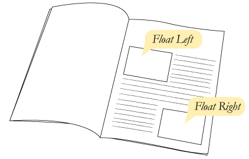
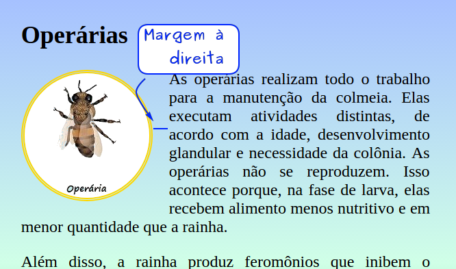
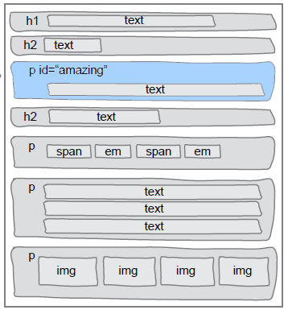
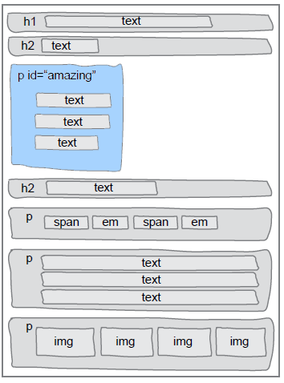
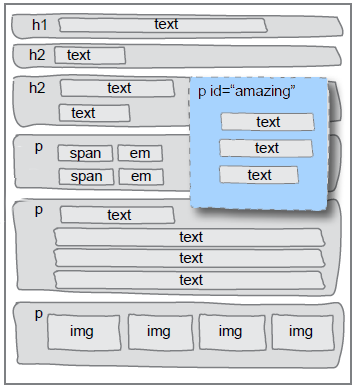
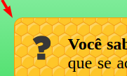

<!-- {"layout": "title"} -->
# CSS parte 1
## Seletores de classe, Flutuação e Abelhas :honeybee:

---
# Na última aula...

- Tabelas são criadas com as tags
  - **`<table>...</table>`**, para marcar a tabela
  - `<thead>...</thead>`, cabeçalho, contém linhas
  - `<tbody>...</tbody>`, corpo, contém linhas
  - `<tfoot>...</tfoot>`, rodapé, contém linhas
  - **`<tr>...</tr>`**, linha da tabela
  - **`<td>...</td>`**, célula de dados
  - `<th>...</th>`, célula do cabeçalho
  - `<caption>...</caption>`, legenda
- [Referência na Mozilla Developer Network][mdn-table]

[mdn-table]: https://developer.mozilla.org/en-US/docs/Web/HTML/Element/table

---
# Hoje veremos

1. [Editores de Texto](#editores-de-texto)
1. [DOCTYPE e Codificação](#doctype-e-codificacao)
1. [Reaproveitando código CSS](#reaproveitando-codigo-css)
1. [Abelhas :honeybee: e suas castas](#abelhas-e-suas-castas)

---
<!-- {"layout": "section-header", "slideHash": "editores-de-texto"} -->
# Editores de texto
## Ferramentas para edição e melhoria da produtividade

- Editores de texto
- _Hotkeys_

<!-- {ul:.content} -->
 
---
<!-- {"layout": "regular"} -->
## Como ser mais **produtivo**

- Na hora de escrever/editar código HTML, CSS e JavaScript, queremos ter:
  - **Destacamento (_highlighting_) de código fonte**
  - **Indentação** automática
  -  <!-- {.push-right} -->
    **Auto-completar** tags HTML, propriedades CSS etc.
- Editores indicados:
  - [Atom][atom] (gratuito, do GitHub)
  - [Sublime Text 3][sublime] (pago, faz vista grossa com quem não paga)
  - [VSCode][vscode] (gratuito, do tio Bill)

[atom]: https://atom.io/
[sublime]: https://www.sublimetext.com/3
[vscode]: https://code.visualstudio.com/

---
<!-- {"layout": "regular"} -->
## Sugestão do Professor

- [](https://atom.io)
  Benefícios:
  - **Gratuito**
  - Altamente **personalizável**
  - Muitas **_hotkeys_ (teclas de atalho) \o/**
  - **Atenção:** as _hotkeys_ e sugestões no _Atom_ **só** irão funcionar
    após salvar o arquivo como **html**

---
<!-- {"layout": "2-column-content"} -->
## _Hotkeys_ Úteis - Criando um Novo Arquivo HTML

<video src="../../videos/atom-html.mp4" height="340" controls style="margin: 0 auto;"></video>

- Crie o arquivo e salve com a extensão **`.html`** (_e.g._, `index.html`)
- Digite `html` e pressione <kbd>tab</kbd>
- Aparecerá a estrutura básica do html
- Isso funciona para todas as _tags_. Exemplo:
  - Digite `em` e pressione <kbd>tab</kbd>

---
## _Hotkeys_ Úteis - Visualização prévia do código

- Pressione <kbd>Ctrl</kbd>+<kbd>Shift</kbd>+<kbd>M</kbd>

<video src="../../videos/coding-simple-table.mp4" height="400" controls style="margin: 0 auto;"></video>


---
<!-- {"layout": "section-header", "slideHash": "doctype-e-codificacao"} -->
# Codificação e DOCTYPE

- Codificação do arquivo
  - Como um texto é armazenado em seu computador?
    - ASCII
    - UNICODE e UTF-8
- Versão do HTML:
  - DOCTYPE

<!-- {ul^3:.content} -->

---
<!-- {"layout": "2-column-content"} -->
## Como o texto é armazenado em seu computador?

<!-- {.push-right style="height: 300px"} -->
- Arquivos HTMLs são representados como arquivos textuais
- Porém, internamente, eles são armazenados no formato **numérico** em **binário**
- Codificação é um **<u>mapeamento</u> de letras para números**
- Na web há vários tipos de codificações:
  - (1) ASCII, (2) UNICODE, ...

---
<!-- {"layout": "regular"} -->
## Codificação **ASCII**

- ASCII é um dos **mais antigos** padrões de codificação
- Cada caractere (letra) é representada por um número
- Esta codificação possui:
  - Letras do alfabeto latino/romano
  - Pontuações
  - Números e símbolos matemáticos
  - Símbolos de controle (tab, espaço...)

---
<!-- {"layout": "2-column-content"} -->
## **Tabela ASCII**

| Código| Letra 	|
|:-----:|:-------:|
| ⋮    |   ⋮     |
| 32    | Espaço 	|
| 33    |     ! 	|
| 34    |     "   |
| ⋮    |    ⋮    |
| 65    |    A    |
| 66    |    B    |
| 67    |    C    |
| ⋮    |    ⋮    |

| Código| Letra 	|
|:-----:|:-------:|
| ⋮    |   ⋮     |
| 97    |    a    |
| 98    |    b    |
| 99    |    c    |
| ⋮    |    ⋮    |

---
## Codificação **Unicode** e UTF-8

- Unicode provê o suporte multilíngua
  - Diversos alfabetos, não apenas o romano/latino

- **UTF-8** é uma codificação que usa uma sequência de **8 bits** para
  armazenar códigos UNICODE


---
## Codificação em uma Página web

- Geralmente, tem-se utilizado UTF-8 nas páginas Web. Porém, nem todas as
  páginas Web são UTF-8.

- Por isso, precisamos especificar qual codificação usamos

- Usa-se a `<meta>` _tag_ com o atributo `charset` para isso:
  ```html
  <meta charset="ISO-8859-1"> <!-- ASCII romano/latino -->
  <meta charset="utf-8">      <!-- utf-8 -->
  ```

---
## Codificação em uma Página web (cont.)

- A codificação de uma página deve ser especificada de forma explícita
    - Senão, UTF-8 é inferido
- Opções de codificação são gerenciadas pela IANA e [podem ser vistas aqui](http://www.iana.org/assignments/character-sets/character-sets.xhtml)

-  <!-- {.push-right style="height: 300px"} -->
  Erro de codificação:

---
# DOCTYPE - Versão do HTML
---
<!-- {"layout": "regular"} -->
## DOCTYPE

- Especifica para o navegador qual a versão do HTML que estamos usando
- Aparece como a primeira "tag" em um arquivo `html`
- Formato:
  ```html
  <!DOCTYPE ... >
  ```

---
<!-- {"layout": "regular"} -->
## Evolução do DOCTYPE

- HTML 4.01
  ```xml
  <!DOCTYPE html PUBLIC "-//W3C//DTD HTML 4.01//EN"
  "http://www.w3.org/TR/html4/strict.dtd">
  ```
- XHTML 1.1
  ```xml
  <!DOCTYPE html
    PUBLIC "-//W3C//DTD XHTML 1.1//EN"
    "http://www.w3.org/TR/xhtml11/DTD/xhtml11.dtd">
  ```

---
<!-- {"layout": "regular"} -->
## DOCTYPE hoje

- HTML5
  ```xml
  <!DOCTYPE html>
  ```
  

<!--
<!- {"layout": "regular"} ->
## E se colocarmos um DOCTYPE inválido?

- O navegador possui o conceito de _strict mode_ e o de _quirks mode_
- Problemas com o DOCTYPE vão ativar o **_quirks mode_**
  - Para páginas sem DOCTYPE ou com DOCTYPEs que o navegador não conhece
- Em _quirks mode_, o navegador é altamente **permissivo com relação a marcação
  incorreta** e ele utiliza um interpretador antigo para algumas propriedades
  CSS
- [Artigo sobre o _quirks mode_ no site quirksmode.org][quirks-mode] :)

[quirks-mode]: http://www.quirksmode.org/css/quirksmode.html
-->
---
<!-- {"layout": "section-header", "slideHash": "reaproveitando-codigo-css"} -->
# Reaproveitando código CSS
## Seletor de classe, incluindo arquivo e mais sobre cores

- Seletor de classes
- Incluindo arquivos **CSS**
- Cores e Gradientes

<!-- {ul:.content} -->

---
## Relembrando... **seletor** e **declaração**


---
<!-- {"state":"show-active-slide-and-previous"} -->
## **propriedade** e **valor**


---
<!-- {"layout": "regular"} -->
## Problema: **selecionando** elementos

- Como fazemos para selecionar (_e.g._):
  1. apenas **alguns parágrafos** em vez de todos?
  1. apenas o **primeiro título h2** da página?
  1. apenas **uma imagem em especial**?
- Uma solução possível é usar os atributos universais¹ HTML chamados
  **`class`** e **`id`** para identificar os elementos e estilizá-los

  > **Atributos universais¹**: aqueles que qualquer elemento pode ter
  >

---
<!-- {"layout": "regular"} -->
## Selecionar **por nome de _tag_**

- Até agora, estilizamos elementos HTML de duas formas:
- **Primeira forma:** Selecionando a tag:
  ```css
  p {
    color: blue;
  }
  ```
  - Isso faz com que **todos os parágrafos** sejam estilizados com a cor azul

---
<!-- {"layout": "regular"} -->
## Selecionar **por `id`**

- **Segunda forma:** selecionando 01 elemento em específico
  - Supondo que temos: `<p id="resumo">Este é o resumo da notícia...</p>`:
  ```css
  #resumo {
    color: blue;
  }
  ```
  - Deixando de cor azul apenas o parágrafo cujo `id` é `resumo`.
  - Como fazemos, então, para estilizar não apenas 01, mas **um subconjunto de
    elementos** da forma como queremos?
    - Resposta: usando **classes**

---
<!-- {"layout": "regular","slideHash": "css-seletor-por-classe"} -->
## Selecionar **por classe**

- Dada a seguinte estrutura de um `<body></body>`:
  ```html
  <p>Primeiro</p>
  <p>Segundo</p>
  <p>Terceiro</p>
  ```
- Para criar uma regra CSS para, digamos, os dois primeiros parágrafos, podemos
  alterar a estrutura HTML para:
  ```html
  <p class="destacado">Primeiro</p>
  <p class="destacado">Segundo</p>
  <p>Terceiro</p> <!-- continua no próximo slide -->
  ```

---
## Selecionar por classe (cont.)

- E, em um arquivo CSS, podemos escrever o nome da _tag_, seguido por um ponto
   "`.`", seguido pelo nome da classe:
  ```css
  p.destacado {
    font-weight: bold; /* negrito */
  }
  ```
- Ou, se quisermos usar a classe `destacado` para outros elementos além de
  `<p></p>`, podemos omitir o nome da _tag_:
  ```css
  .destacado {
    font-weight: bold;
  }
  ```

---
<!-- {"slideHash": "incluindo-css"} -->
# Incluindo arquivo CSS

- Por enquanto, colocamos o CSS **dentro do arquivo HTML**
   ```html
   <style> /* reaproveitamento de código CSS dentro do arquivo */
     p {
       color: #fff;
     }     /* misturamos código CSS dentro do arquivo HTML */
   </style>
   ```
   - Mas **isto é uma prática ruim**! :scream:

---
## Referenciando o **CSS usando a tag _link_**

- Um arquivo HTML podoe referenciar um CSS assim:
  ```html
  <link rel="stylesheet" href="arquivo-de-estilos.css">
  ```
  - Mais de um arquivo HTML pode usar esse CSS
    - **Reaproveitamento** de código CSS
  - **_Caching_** do arquivo CSS: o arquivo é baixado apenas uma vez e
    usado sempre que necessário
    - Útil se o site tem várias páginas

---
## Referenciando o CSS : **Atalho do Atom**

- Esqueceu toda a sintaxe (forma de escrita)?
- Digite apenas `link` e, logo após, aperte <kbd>tab</kbd>:

<video src="../../videos/link-css-atom.mp4" height="340" controls style="margin: 0 auto;"></video>

---
<!-- {"slideHash": "cores-e-gradientes","embeddedStyles": ".color-text { color: #afaf03; } .gradient-text { background: linear-gradient(to right, #1bff00, #44b2d8, #b934d0); -webkit-background-clip: text; -webkit-text-fill-color: transparent;}" } -->
# <span class="color-text">Cores</span> e <span class="gradient-text">Gradientes</span>

---
## Notações RGB e Hexadecimal


---
## Cores

- Exemplos de cores:
  ```
  #ff0033                   /* Cor RGB em hexadecimal */
  #F03                      /* Mesmo que anterior */
  rgb(255, 0, 51)
  rgb(100%, 0%, 20%)
  hsl(60, 100%,50%)
  rgba(255,0,0,0.1)         /* Vermelho 10% opaco */  
  hsla(240,100%,50%,0.05)   /* Azul 5% opaco */
  brown
  gold
  ```

---
<!-- {"slideHash": "escolhendo-cores"} -->
## Escolhendo cores (<kbd>F12</kbd>)

<video src="../../videos/escolhendo-cores.mp4" height="460" controls style="margin: 0 auto;"></video>

---
## Gradientes

- `linear-gradient` é um **valor válido para `background-image`**,
      e não para `background-color`
  - Veja a documentação do que é um [`gradient`](https://developer.mozilla.org/en-US/docs/Web/CSS/gradient)


---
## Exemplo de Uso (1/3)

- ```css
  p {
    background-image: linear-gradient( 45deg, blue, #00FF00 );
  }
  ```
  ::: result
  - 45 graus, iniciando com azul e terminando como verde <!-- {li:style="background-image: linear-gradient( 45deg, blue, #00FF00 )"} -->
  :::

---
## Exemplo de Uso (2/3)

- ```css
  p {
    background-image: linear-gradient( to left top, yellow, blue );
  }
  ```
  ::: result
  - Começa amarelo e termina azul no canto esquerdo superior  <!-- {li:style="background-image: linear-gradient( to left top, yellow, blue )"} -->
  :::

---
## Exemplo de Uso (3/3)

- ```css
  p {
    background-image: linear-gradient( 90deg, blue, white 20%, #00FF00 );
  }
  ```
  ::: result
  - Azul, branco e verde <!-- {li:style="background-image:linear-gradient( 90deg, blue, white 20%,#00FF00);"} -->
  :::

---
<!-- {"layout": "section-header", "slideHash": "abelhas-e-suas-castas"} -->
# Abelhas :honeybee: e suas castas
## :honey_pot: :honey_pot: :honey_pot: :honey_pot: :honey_pot:

- A atividade das abelhas
- Flutuando coisas
- Pesquisando novas propriedades CSS/elementos HTML

<!-- {ul:.content} -->

---
<!-- {"backdrop": "pratica-abelhas"} -->

---
<!-- {"layout": "regular"} -->
# Abelhas :honeybee: e suas castas

1. [Baixe as imagens e páginas](https://github.com/fegemo/cefet-front-end-bees/archive/master.zip)
   que serão usados
   1. Descompacte o arquivo `cefet-front-end-bees-master.zip` na área de trabalho
      - Isto criará uma pasta com o nome `cefet-front-end-bees-master` lá
   1. **Renomeie** a pasta criada na área de trabalho para `site-abelhas`
      - Esta é a **pasta raiz** do site - onde devem ficar os arquivos `.html`
   1. Veja [instruções detalhadas aqui](https://github.com/fegemo/cefet-front-end-bees/blob/master/README.md)

---
<!-- {"layout": "regular", "slideHash": "flutuando-coisas"} -->
# Flutuando coisas

>  <!-- {.push-right style="height: 200px;"} -->
  **Jornais e revistas** costumam colocar **imagens junto ao texto** para
  fazer uma bela diagramação do conteúdo
> <cite>Coutinho, 2017</cite>
> Isso se chama **deixar o elemento** (_e.g._, imagem) **flutuando**
> <cite>Hasan, 2017</cite>

- Na web também queremos fazer isso!

---
## Como flutuar elementos usando CSS?




---
## Propriedade `float`

- Usado para alterar o fluxo tradicional da página
  - Em CSS:  
    ```css
    img#abelha-operaria {
      float: left; /* right, none */
    }              /* none é o valor padrão - sem flutuação*/
    ```
  - No HTML:
    ```html
    
    <p>Texto ...</p>
    ```

---
## Propriedade `float` (cont.)

-  <!-- {.push-right} -->
  Um elemento flutuante é removido do fluxo tradicional e
  - os elementos `block` depois dele fingem que ele não está ali
  - os elementos `inline` depois dele respeitam seu formato
- Vamos fazer com que o parágrafo com `id="amazing"`
  flutue à direita **nos próximos 2 slides**...

---
## Exemplo de `float` (1º passo)

-   <!-- {.push-right style="max-height: 440px;"} -->
  Alterando a largura de um parágrafo para 200px
  ```css
  p#amazing {
    width: 200px;
  }
  ```

---
## Exemplo de `float` (2º passo)

-   <!-- {.push-right style="max-height: 440px;"} -->
  Flutuando o parágrafo à direita
  ```css
  p#amazing {
    width: 200px;
    float: right;
  }
  ```
  - Repare que:
    - Elementos declarados <u>antes</u> do parágrafo flutuante
      **não são alterados**
    - Elementos declarados <u>depois</u>:
      - Se forem `block`, **ignoram** o elemento flutuante
      - Se forem `inline`, **respeitam** o elemtno flutuante

---
<!-- {"slideHash": "arredondando-bordas"} -->
# Arredondando bordas

-  <!-- {.push-right} -->
  Como arredondar bordas?
  - Há muitas propriedades CSS que não teremos tempo de ver no curso
  - Contudo, a Web é uma ótima fonte de informação
  - Pesquise ["como arredondar bordas em CSS" no Google][border-radius-google],
    por exemplo

[border-radius-google]: http://lmgtfy.com/?q=como+arredondar+bordas+em+css

---
# Referências

1. Capítulos 5 e 6 do livro
