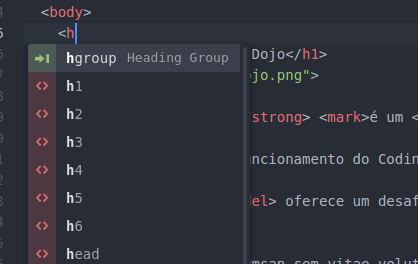
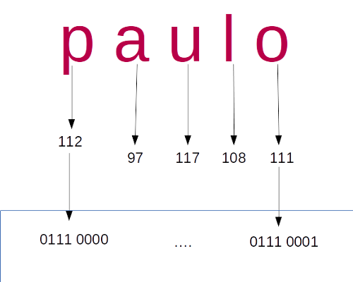
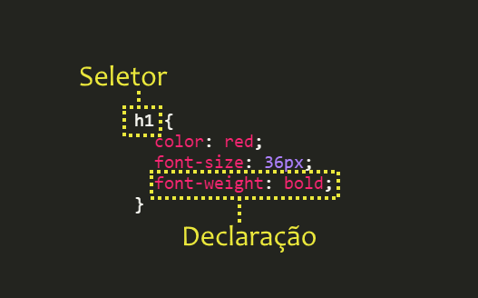

<!-- {"layout": "title"} -->
# CSS: Parte 1
## Ferramentas de Edição, codificação e versões de HTML

---
## Na última aula...

- Podemos **criar hiperlinks** com o elemento `<a href="caminho-do-recurso">nome</a>`
- Para **incluir imagens**, podemos usar a tag ``
- Citações são criadas com `<q>` ou `<blockquote>`
- Alguns elementos são `inline` e outros são `block`
  - **`inline`**: não fazem quebra de linha (e.g, `<q>`, `<strong>` etc.)
  - **`block`**: fazem quebra de linha (e.g., `<blockquote>`, `<p>` etc.)

---
## Na última aula... (cont.)

- Tabelas são criadas com as tags
  - **`table`**, para marcar a tabela
  - `thead`, cabeçalho
  - `tbody`, corpo
  - `tfoot`, rodapé
  - **`tr`**, linha
  - **`td`**, célula
  - `th`, célula do cabeçalho
- [Referência na Mozilla Developer Network][mdn-table]

[mdn-table]: https://developer.mozilla.org/en-US/docs/Web/HTML/Element/table


---
# Hoje veremos

# Roteiro de hoje
1. Editores de Texto
1. DOCTYPE e Codificação
1. CSS: Incluindo CSS; Seletor de classe; Cores em Hexa e Gradientes

---
<!-- {"layout": "section-header"} -->
# Editores de texto
## Ferramentas para edição e melhoria da produtividade

- Editores de texto
- _Hotkeys_

---
<!-- {"layout": "regular"} -->
## Como ser mais **produtivo**

- Na hora de escrever/editar código HTML, CSS e JavaScript, queremos ter:
  - **Destacamento (_highlighting_) de código fonte**
  - **Indentação** automática
  - **Auto-completar** tags HTML, propriedades CSS etc.
 <!-- {.push-right} -->

- É desejável:
  - Suporte a controle de versão (_e.g._, git)
  - _Linting_ (verificação estática de erros no código)

---
<!-- {"layout": "regular"} -->
## Exemplos com **_Seal of Approval_** do Professor


  - [Atom][atom] (gratuito, do GitHub)
  - [Sublime Text 3][sublime] (pago, faz vista grossa com quem não paga)
  - [VSCode][vscode] (gratuito, do tio Bill)
<!--- IDE:
  - [WebStorm][webstorm] (pago, da JetBrains)
  - [Visual Studio Express][visual] (gratuito, do tio Bill)
-->
[atom]: https://atom.io/
[sublime]: https://www.sublimetext.com/3
[vscode]: https://code.visualstudio.com/
[notepad]: https://notepad-plus-plus.org/
[webstorm]: https://www.jetbrains.com/webstorm/
[visual]: https://www.visualstudio.com/features/modern-web-tooling-vs

---
<!-- {"layout": "regular"} -->
## Sugestão do Professor

- [](https://atom.io)
  Benefícios:
  - **Gratuito**
  <!--- Mais **leve** do que um IDE-->
  - Altamente **personalizável**
  <!-- Exemplo de **"web fora do navegador"** - É baseado no Chromium e no Node.js
  - Suporte nativo a **Git**-->
  - Suporte para versionamento de código (nativo **Git**)
  - Muitas **_hotkeys_ \o/**
  - **Atenção:** As _hotkeys_ e sugestões no _Atom_ **só** irão funcionar após salvar o arquvo como **html**
---
<!-- {"layout": "2-column-content"} -->
## _Hotkeys_ Úteis - Criação de um Novo Arquivo HTML
<video src="../../videos/atom-html.mp4" height="340" controls style="margin: 0 auto;"></video>
  - Crie o arquivo e salve como **html**
  - Digite `html` e pressione `tab`
  - Aparecerá a estrutura básica do html


---
## _Hotkeys_ Úteis - Visualização prévia do código

- Pressione <kbd>Ctrl+Shift+M</kbd>

<video src="../../videos/coding-simple-table.mp4" height="400" controls style="margin: 0 auto;"></video>


---
<!-- {"layout": "section-header"} -->
# Codificação e DOCTYPE


- Representacação do arquivo: Codificação
  - Como um texto é armazenado em seu computador?
  - ASCII
  - UNICODE e UTF-8
- Representação versão do HTML:
  - DOCTYPE

---
<!-- {"layout": "2-column-content"} -->
## Codificação - Como o texto é armazenado em seu computador?

<!-- {.push-right style="height: 300px"} -->
- Arquivos HTMLs são representados como arquivos textuais
- Porém, internamente, eles são armazenados no formato **numérico** em **binário**

- Na web há vários tipos de codificações:
  - ASCII, UNICODE, ...

---
## Codificação ASCII
- ASCII é um dos mais antigos padrões de codificação
- Cada caractere (letra) é representada por um número.
- Esta codificação possui:
  - Letras do alfabeto latino/romano
  - Pontuações
  - Números e símbolos matemáticos
  - Símbolos de controle (tab, espaço...)

---
<!-- {"layout": "2-column-content"} -->
## Tabela ASCII
| Código| Letra 	|
|-------|---------|
| ...   |   ...   |
| 32    | Espaço 	|
| 33    |     ! 	|
| 34    |     "   |
| ...   |    ...  |
| 65    |    A    |
| 66    |    B    |
| 67    |    C    |

| Código| Letra 	|
|-------|---------|
| ...   |   ...   |
| 97    |    a    |
| 98    |    b    |
| 99    |    c    |
---
## Codificação Unicode e UTF-8

- Unicode provê o suporte multilíngua
  - Diversos alfabetos, não apenas o romano/latino

- **UTF-8** é uma codificação que usa uma sequência de **8 bytes** para armazenar códigos UNICODE


---
## Codificação em uma Página web

- Geralmente, tem-se utilizado UTF-8 nas páginas Web. Porém, nem todas as páginas Web são UTF-8.

- Por isso, precisamos especificar qual codificação usamos

- Usa-se a `<meta>` _tag_ com nome `charset` para isso:
  ```html
  <meta name="charset" content="ISO-8859-1">
  ```

---
## Codificação em uma Página web (cont)
- A codificação de uma página deve ser especificada de forma explícita
    - Senão, UTF-8 é inferido
- Opções de codificação são gerenciadas pela IANA e [podem ser vistas aqui](http://www.iana.org/assignments/character-sets/character-sets.xhtml)
-  <!-- {.push-right style="height: 200px"} -->
  Erro de codificação:
  - Deve-se manter a mesma codificação nos arquivos, declarado no HTML e (se for o caso) no banco de dados

---
# DOCTYPE - Versão do HTML
---
<!-- {"layout": "regular"} -->
## DOCTYPE

- Especifica para o navegador qual a versão do `html` que estamos usando
- Aparece como a primeira "tag" em um arquivo `html`
- Formato
  ```html
  <!DOCTYPE ... >
  ```

---
<!-- {"layout": "regular"} -->
## Evolução do DOCTYPE

- HTML 4.01
  ```xml
  <!DOCTYPE html PUBLIC "-//W3C//DTD HTML 4.01//EN"
  "http://www.w3.org/TR/html4/strict.dtd">
  ```
- XHTML 1.1
  ```xml
  <!DOCTYPE html
    PUBLIC "-//W3C//DTD XHTML 1.1//EN"
    "http://www.w3.org/TR/xhtml11/DTD/xhtml11.dtd">
  ```

---
<!-- {"layout": "regular"} -->
## DOCTYPE hoje

- HTML5
  ```xml
  <!DOCTYPE html>
  ```
  

---
<!-- {"layout": "regular"} -->
## E se colocarmos um DOCTYPE inválido?

- O navegador possui o conceito de _strict mode_ e o de _quirks mode_
- Problemas com o DOCTYPE vão ativar o **_quirks mode_**
  - Para páginas sem DOCTYPE ou com DOCTYPEs que o navegador não conhece
- Em _quirks mode_, o navegador é altamente **permissivo com relação a marcação
  incorreta** e ele utiliza um interpretador antigo para algumas propriedades
  CSS
- [Artigo sobre o _quirks mode_ no site quirksmode.org][quirks-mode] :)

[quirks-mode]: http://www.quirksmode.org/css/quirksmode.html

---
<!-- {"layout": "section-header"} -->
# CSS
## Seletor de classe, incluindo arquivo e mais cores

- Seletor de Classes
- Incluindo arquivo **CSS**
- Cores e Gradiente


---
## Relembrando...Sintaxe: **seletor** e **declaração**



---
## Sintaxe: **propriedade** e **valor**


---
## Problema: **selecionando** elementos

- Como fazemos para selecionar (_e.g._):
  1. apenas **alguns parágrafos** em vez de todos?
  1. apenas o **primeiro título h2** da página?
  1. apenas **uma imagem em especial**?
- Uma solução possível é usar os atributos universais¹ HTML chamados
  **`class`** e **`id`** para identificar os elementos e estilizá-los
  - ¹: atributos que qualquer elemento pode ter


---
## Seletor de Classe

- Até agora, estilizamos elementos `html` de duas formas:
- **Primeira forma:** Selecionando a tag:
  ```css
  p {
    color: blue;
  }
  ```
  - Isso faz com que **todos** os parágrafos sejam estilizados com a cor azul

---
## Classe (Cont.)

- **Segunda forma:** selecionando um elemento em específico
  - Supondo que temos um parágrafo `<p id="primParagrafo">Oi!</p>`:
  ```css
  #primParagrafo {
    color: blue;
  }
  ```
  - Deixando  de cor azul apenas o parágrafo cujo seu id é  `primParagrafo`.
  - Como fazemos, então, para estilizar apenas um ou um subconjunto de
    parágrafos da forma como queremos?
    - Resposta: usando **classes**

---
## Classe (cont.)

- Dada a seguinte estrutura de um &lt;body&gt;&lt;/body&gt;:
  ```html
  <p>Primeiro</p>
  <p>Segundo</p>
  <p>Terceiro</p>
  ```
- Para criar uma regra `CSS` para, digamos, os dois primeiros parágrafos, podemos
  alterar a estrutura `html` para:
  ```html
  <p class="destacado">Primeiro</p>
  <p class="destacado">Segundo</p>
  <p>Terceiro</p>
  ```
- continua...

---
## Classe (cont.)

- E, em um arquivo `CSS`, podemos escrever o nome da _tag_, seguido por um ponto
   "`.`", seguido pelo nome da classe:

```css
  p.destacado {
    font-weight: bold; /* negrito */
  }
```

- Ou, se quisermos usar a classe `destacado` para outros elementos que não
  `<p></p>`, podemos omitir o nome da _tag_:

```css
  .destacado {
    font-weight: bold;
  }
```

---
# Incluindo arquivo CSS

- Por enquanto, colocamos o CSS dentro do HTML
   ```html
   <style> /* reaproveitamento de código CSS dentro do arquivo */
     p {
       color: #fff;
     }     /* ainda há mistura de código */
   </style>
   ```

---
# Referenciando o CSS usando a tag _link_
- Podemos referenciar um CSS da seguinte forma
   ```html
   <link rel="stylesheet" href="arquivo-de-estilos.css" />
   ```
   - Reaproveitamento de código CSS em qualquer arquivo
   - _Caching_ do arquivo CSS: o arquivo é baixado apenas uma vez e usado sempre que necessário
    - útil se o site tem várias páginas
---
## Referenciando o CSS usando a tag _link_: Atalho Atom
- Esqueceu toda a sintaxe (forma de escrita)?
- Digite apenas `link` e, logo após, aperte `tab`:

<video src="../../videos/link-css-atom.mp4" height="340" controls style="margin: 0 auto;"></video>

---
<!-- {"embeddedStyles": ".color-text { color: #afaf03; } .gradient-text { background: linear-gradient(to right, #1bff00, #44b2d8, #b934d0); -webkit-background-clip: text; -webkit-text-fill-color: transparent;}" } -->
# <span class="color-text">Cores</span> e <span class="gradient-text">Gradientes</span>


---
## Cor

- Em `CSS`, existe um [tipo de dados `color`](https://developer.mozilla.org/en-US/docs/Web/CSS/color_value)
- Um valor de `color` pode ser dado por:
  - uma palavra-chave
  - um valor do espaço cúbico RGB (em hexadecimal, `rgb()` ou `rgba()`)
  - um valor do espaço cilíndrico HSL (`hsl()` ou `hsla()`)

---
## Cor (cont.)

- Exemplos de cores:
  ```css
  #ff0033
  #F03                      /* Mesmo que anterior */
  rgb(255, 0, 51)
  rgb(100%, 0%, 20%)
  hsl(60, 100%,50%)
  rgba(255,0,0,0.1)         /* 10% opaque red */  
  hsla(240,100%,50%,0.05)   /* 5% opaque blue */
  rebeccapurple
  ```

  <div style="font-size: 1.5em; color: #663399; font-family: Calligraffitti, cursive">Rebecca Purple</div>

---
## Gradientes

- Assim como `color`,
  [`gradient`](https://developer.mozilla.org/en-US/docs/Web/CSS/gradient) é
  um tipo de dados em CSS

- `linear-gradient` é um **valor válido para `background-image`**,
      e não para `background-color`


---
## Exemplo de Uso (1/3)

- ```css
    p{
      background-image: linear-gradient( 45deg, blue, #00FF00 );
    }
    ```
::: result
- 45 graus, iniciando com azul e terminando como verde <!-- {li:style="background-image: linear-gradient( 45deg, blue, #00FF00 )"} -->
:::

---
## Exemplo de Uso (2/3)
- ```css
      p{
        background-image: linear-gradient( to left top, yellow, blue );
      }
    ```
::: result
- Começa amarelo e termina azul no canto esquerdo superior  <!-- {li:style="background-image: linear-gradient( to left top, yellow, blue )"} -->
:::


---
## Exemplo de Uso (3/3)
- ```css
        p{
          background-image: linear-gradient( 90deg, blue, white 20%, #00FF00 );
        }

  ```
::: result
- Azul, branco e verde <!-- {li:style="background-image:linear-gradient( 90deg, blue, white 20%,#00FF00);"} -->
:::


---


# Referências

1. Capítulos 5 e 6 do livro
