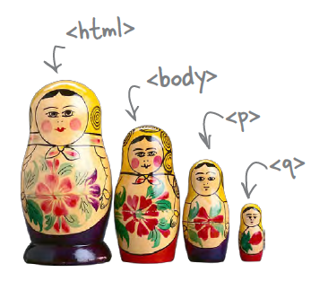
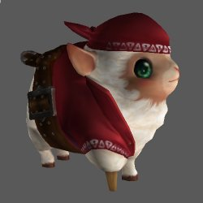

<!-- {"layout": "title"} -->
# HTML (parte 1)
## Plantas Carnívoras, Ingredientes do HTML (_tags_) e Temperando com CSS

---
<!-- {"layout": "regular"} -->
# Na última aula...

- Conversamos sobre a história da Internet e da Web
-  <!-- {.portrait.push-right} --> Vimos as proezas de Tim (Berners-Lee), o coração valente, ao criar:
  - O protocolo HTTP
  - A linguagem HTML
  - Um servidor web (CERN httpd)
  - O primeiro navegador (WorldWideWeb)
  - ~~A linguagem CSS~~ (não foi o Tim :scream:)
  - ~~A linguagem JavaScript~~ (não foi o Tim :scream:)

---
# Atividade de Hoje

Você tem um novo _hobby_: **criar plantas carnívoras**. Você encontrou um
documento solto em um antigo livro do seu tio e, depois de lê-lo, decidiu
**criar uma página web com seu conteúdo**.


---
<!-- {"layout": "regular"} -->
# Para isso, hoje vamos...

- Conhecer Estrutura básica de um arquivo HTML
- Aprender algumas _tags_ HTML para:
  - parágrafos `<p>...</p>`
  - títulos `<h1>...</h1>`, ou `<h2>...</h2>` etc. (até `<h6>...</h6>`)
  - imagens ``
  - hiperlinks `<a href="">...</a>`
- Entender um pouco de estilo CSS:
  - `color`, `background-color`
  - `margin`, `text-align`

---
<!-- {"layout": "section-header"} -->
# Funcionamento da Web
## Como o navegador conversa com o servidor

- Modelo de **requisição e resposta**
  1. **Navegador** requisita uma página
  1. **Servidor** responde
- **URL**: como identificar um recurso

<!-- {ul:.content} -->

---
## O que um **navegador** faz?

- Quando o usuário "vai" até um novo endereço (URL), o navegador solicita esse
  **recurso** ao servidor
  - O **Navegador requisita** algo e **Servidor responde**

```http
GET /index.html HTTP/1.1
Host: www.twitter.com
```
 <!-- {.half-width.centered} --> <!-- {p:.no-margin} -->
```http
HTTP/1.1 200 OK
Date: Mon, 23 May 2005 22:38:34 GMT
Server: Apache/1.3.3.7 (Unix) (Red-Hat/Linux)
Content-Type: text/html; charset=UTF-8
Content-Length: 131

<!DOCTYPE html>
<html>
<head>
  <title>Twitter</title>
</head>
<body>
  Olá mundo, este é um tweet.
</body>
</html>
```

---
## O que um **navegador** faz (cont.)?

- URL: Unique **Resource** Locator
  - É o **endereço de coisas** na Internet - **páginas, imagens, arquivos**, etc.   
     <!-- {.block} -->
- Assim que a resposta é recebida, o navegador a exibe na tela, caso **consiga**
  - Por exemplo, os navegadores não conseguem exibir um arquivo .zip

---
<!-- {"layout": "section-header"} -->
# Estrutura Básica do **HTML**
## .

- O que é uma _tag_
- Anatomia da _tag_
- Um arquivo HTML completo

<!-- {ul:.content} -->

---


---
<!-- {"state":"show-active-slide-and-previous"} -->


- Demonstração: criando uma página no "blocão"

---
## Estrutura

- Um punhado de **tags** no texto
  - As _tags_ fazem a marcação da estrutura do texto
  - Existem dezenas de tags (umas 50? 60?) e cada uma tem um propósito e um
    resultado visual
  - A grande maioria delas precisam ser fechadas (e.g., `<p>...</p>`)
- **Indentação e espaçamento** são livres e não afetam o resultado
- Um arquivo html é _plain-text_, ou puramente textual
  - em contraposição a um arquivo binário, por exemplo

---
## Estrutura (cont.)



---
## A _tag_ &lt;html&gt;

- Envolve todas* as outras _tags_
  - *Exceto a _tag_ especial `<!DOCTYPE html>`
- Dentro dela, **devem existir todas e apenas**, nesta ordem:
  - `<head>...</head>`
  - `<body>...</body>`

---
## A _tag_ &lt;head&gt;

- Do inglês: cabeça
- Contém **meta-informação** sobre este arquivo `html`
  - Título da página (obrigatório)
  - Descrição da página
  - Ícone
  - Inclusão de arquivos (`.css`, `.js`)
- Trecho de código

```html
<html>
  <head>
    <title>Este é o título que aparece na aba</title>
    ...
  </head>
  ...
```

---
## A _tag_ &lt;body&gt;

- Do inglês: corpo
- Contém **todo o conteúdo da página**: _tags_ de
  - parágrafos (`<p>...</p>`)
  - títulos e subtítulos (`<h1>...</h1>`)
  - imagens (``), etc.
- Trecho de código
```html
<html>
  <head>...</head>
  <body>
    ...
  </body>
<html>
```

---
## _Tag_ de Parágrafo (&lt;p&gt;...&lt;&#47;p&gt;)

- Para marcar onde um parágrafo começa e onde ele termina
  ```html
  <p>
      You'll find us right in the center of
      downtown Webville. Come join us!
  </p>
  ```
- Resultado: apenas um bloco de texto, como esperávamos
  <iframe width="100%" height="120" src="https://jsfiddle.net/fegemo/ofs1csr0/embedded/result/" allowfullscreen="allowfullscreen" frameborder="0"></iframe>  

---
## _Tag_ de Parágrafo (&lt;p&gt;...&lt;&#47;p&gt;) (cont.)

- **Quebras de linha são feitas automaticamente** dentro de um parágrafo e não
  necessariamente no mesmo lugar que você quebrou a linha no seu código fonte
```html
<p>
  "Um dos maiores problemas encontrados em viajar no tempo não é
  vir a se tornar acidentalmente seu próprio pai ou mãe. Não há
  nenhum problema em tornar-se seu próprio pai ou mãe com que
  uma família de mente aberta e bem ajustada não possa lidar."
</p>
```

---
## _Tag_ de Parágrafo (&lt;p&gt;...&lt;&#47;p&gt;) (cont.)

- Resultado: um bloco de texto com quebras de linha onde foram necessárias.
  <iframe width="100%" height="300" src="https://jsfiddle.net/fegemo/62afu86f/embedded/result,html/" allowfullscreen="allowfullscreen" frameborder="0"></iframe>

---
## _Tag_ de Seções e Subseções (h1, h2, ..., h6):

  - Para marcar seções, subseções, subsubseções...
```html
    <h1>Seção</h1>
    Este é o corpo da seção
    <h2>Subseção</h2>
    Este é o corpo da subseção
```
<iframe width="100%" height="250" src="http://jsfiddle.net/danielhasan/kndxz5kx/embedded/result/" allowfullscreen="allowfullscreen" frameborder="0"></iframe>

---
## _Tag_ de Imagem (&lt;img&gt;):

- Para exibir imagens...
  ```html
  
  ```
    <!-- {height="100px"} -->
- Neste exemplo, você utilizou o **endereço URL** da imagem
- Quando a imagem estiver no seu servidor (computador), podemos usar
  também seu endereço **absoluto** ou **relativo**

---
## Endereço Absoluto e Relativo:


- A imagem está na mesma pasta: `/ovelhas/racas/pira-tovelha.jpg`
- Podemos utilizar seu **endereço absoluto**: `/ovelhas/racas/pira-tovelha.jpg`
- Ou seu **endereço relativo**: `pira-tovelha.jpg` (relativo à página atual)
  ```html
  
  ```

---
## Endereço Absoluto e Relativo:

- Caminho do  HTML: `/ovelhas/racas/raras.html`
- A imagem está na mesma pasta: `/ovelhas/racas/pira-tovelha.jpg`
- Endereço Absoluto:
  ```html
  
  ```
- Endereço Relativo:
  ```html
  
  ```

---
## Endereço Absoluto e Relativo:


<!-- {.push-right} -->

- A imagem está em outra pasta: `/ovelhas/racas/img/pira-tovelha.jpg`
- **Endereço absoluto**: `/ovelhas/racas/img/pira-tovelha.jpg`
- **Endereço relativo**: `img/pira-tovelha.jpg`
  ```html
  
  ```

---
## Endereço Absoluto e Relativo:


<!-- {.push-right} -->

- A imagem está em outra pasta (um nível abaixo): `/ovelhas/pira-tovelha.jpg`
- **Endereço absoluto**: `/ovelhas/pira-tovelha.jpg`
- **Endereço relativo**: `../pira-tovelha.jpg`
  ```html
  
  ```

---
## Endereço Absoluto e Relativo:


<!-- {.push-right} -->

- A imagem está dois níveis abaixo: `/pira-tovelha.jpg`
- **Endereço absoluto**: `/pira-tovelha.jpg`
- **Endereço relativo**: `../../pira-tovelha.jpg`
  ```html
  
  ```

---
<!-- {"layout": "2-column-content"} -->
## Endereço Absoluto e Relativo:


<!-- {p:style="width: 20%"} -->

| End. Absoluto             	| End. Relativo 	|
|---------------------------	|---------------	|
| /ovelhas/racas/c.jpg      	| c.jpg         	|
| /ovelhas/racas/xpto/d.jpg 	| xpto/d.jpg    	|
| /ovelhas/b.jpg            	| ../b.jpg      	|
| /a.jpg                    	| ../../a.jpg   	|

<!-- {table:style="width: 75%"} -->
---
## _Tag_ de **_Hyperlink_**

- [Link para fora da página](http://www.google.com):
  ```html
  <a href="http://www.google.com">Link para fora da página</a>
  ```
- [Link para um arquivo](../../images/flavio-avatar.jpg) que o navegador sabe
  abrir (_e.g._, uma imagem):
  ```html
  <a href="images/flavio-avatar.jpg">Link para um arquivo</a>
  ```
- [Link para um arquivo](../../attachments/exemplo.zip) que o navegador não sabe abrir (_e.g._, `.zip`):
  ```html
  <a href="attachments/exemplo.zip">Link para um arquivo</a>
  ```

---
## Anatomia de uma _tag_


- _tag_ de fechamento: `</h1>`
  - É idêntica à _tag_ de abertura, porém com uma barra antes do nome da _tag_
- Chamamos `<TAG>CONTEÚDO</TAG>` de um **elemento** da página
- Tags de abertura podem ter **atributos**:
  ```html
  
  ```
  - Em ``, o atributo `src="..."` aponta para a URL do arquivo
  - Não deve haver espaço entre seu nome e seu valor: `` (errado!)

---
## Como o navegador decide **como vai exibir** as _tags_ html?

- Estilos padrão
  - Cor: preto
  - Fundo de tela: branco
  - Fonte: Times New Roman
- Cada navegador pode ter um estilo padrão diferente
- É possível e altamente recomendável **criar estilos próprios**
- Vamos conhecer agora uma segunda linguagem: CSS

---
<!-- {"layout": "section-header"} -->
# Um pouco de estilo
## Conhecendo CSS - Cascading Stylesheets

- A _tag_ `<style>...</style>`
- Definindo as propriedades de:
  - Cor do texto: `color`
  - Cor do fundo: `background-color`
  - Margem (espaçamento): `margin`
  - Fonte: `font-family`

<!-- {ul^1:.content} -->

---
## Definindo o estilo

- Adicionamos um novo elemento: `<style>...</style>`
- Podemos colocá-lo no &lt;head&gt; ou no &lt;body&gt;, mas a **melhor prática é
  no cabeçalho**
  ```html
  <html>
    <head>
      <title>Título da página</title>
      <style>

      </style>
    </head>
    <body>
    ...
  ```

---
## Definindo o estilo (cont.)

```css
body {
  background-color: teal;
  color: white;
  margin-left: 20%;
  margin-right: 20%;
  font-family: "Arial", sans-serif;
}

h1 {
  color: yellow;
  font-family: "Courier New", monospace;
  text-align: center;
}

p {
  text-align: justify;
}

h2 {
  color: pink;
}
```

...e o resultado...

---
## Definindo o estilo (cont.)

<iframe width="100%" height="500" src="//jsfiddle.net/fegemo/ojmwh8gb/embedded/result,html,css/" allowfullscreen="allowfullscreen" frameborder="0"></iframe>

---
## Entendendo o estilo: **cores**

- ```css
  body {
    background-color: teal;    
  }
  ```
  Define a **cor** (_color_) **do fundo** (_background_) para azul ocre (_teal_)
  - Mas também poderia ser: `orange`, `red`, `green`, `black` etc.
- ```css
  body {
    color: white;
  }
  ```
  Define a **cor do texto** como branco

---
## Entendendo o estilo: **margens laterais**

-  <!-- {.push-right} -->
  ```css
  body {
    margin-left: 20%;
    margin-right: 20%;
  }
  ```
  Define as **margens** (espaço) laterais da página
  - Também existem: `margin-top` (cima) e `margin-bottom` (baixo)

---
## Entendendo o estilo: **fonte**

-  <!-- {.push-right} -->
  ```css
  body {
    font-family: "Arial", sans-serif;
  }
  ```
  Define a **fonte** do texto **da página**
- ```css
  h1 {
    font-family: "Courier New", monospace;
  }
  ```
  Define a **fonte** sendo usada para o texto de **todos `<h1>` na página**

---
## Entendendo o estilo: **alinhamento do texto**

-  <!-- {.push-right} -->
  ```css
  p {
    text-align: justify;
  }
  ```
-  <!-- {.push-right} -->
  ```css
  text-align: left; /* valor padrão */
  ```
-  <!-- {.push-right} -->
  ```css
  text-align: right;
  ```
-  <!-- {.push-right} -->
  ```css
  text-align: center;
  ```

<!--
## Entendendo o estilo (cont.)

- Coloca uma **borda** preta (_black_) com largura de 2px e pontilhada (_dotted_):
  ```css
  border: 2px dotted black;
  ```
- Altera a **fonte** para `sans-serif` (parecida com Arial):
  ```css
  font-family: sans-serif;
  ```

## Entendendo o estilo (cont.)

- Define um **espaço de preenchimento** de 10px entre a borda e o conteúdo
  ```css
  padding: 10px 10px 10px 10px;
  ```
  - `padding:` é um atalho para
    - `padding-top:`
    - `padding-right:`
    - `padding-bottom:`
    - `padding-left:`
  - Se usarmos a propriedade de atalho, definimos valores para as propriedades
    originais na ordem acima (cima, direita, baixo, esquerda)

## Mais sobre atalhos

- Os **resultados são idênticos** de se fazer:
- ```css
  padding: 10px 10px 10px 10px;
  ```
- ```css
  padding-top: 10px;
  padding-bottom: 10px;
  padding-left: 10px;
  padding-right: 10px;
  ```
- ```css
  padding: 10px;
  ```
-->
---
# Referências

1. Capítulo 1 do livro
